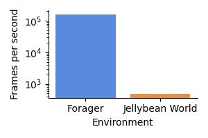
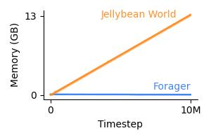

# env-benchmark

Scripts to benchmark the steps per second and memory usage of various
reinformcement learning environments.

## Usage

```bash
./run.sh
```

## Results

Below are the benchmark results for [Jellybean
World](https://github.com/eaplatanios/jelly-bean-world) and
[Forager](https://github.com/andnp/forager) environments, where the same action
is taken at each step, which results in the agent moving in a straight line.

### Steps per second


Steps per second for each environment, higher is better. Forager is around ?x
faster than Jellybean World. Error bars depict the 95% bootstrapped confidence
interval of the mean.

### Memory usage


Memory usage in GB as a function of the number of steps taken for each
environment, lower memory usage is better. Jellybean World uses around ?x less
memory than Forager. Shaded regions represent the 95% bootstrapped confidence
interval of the mean.
